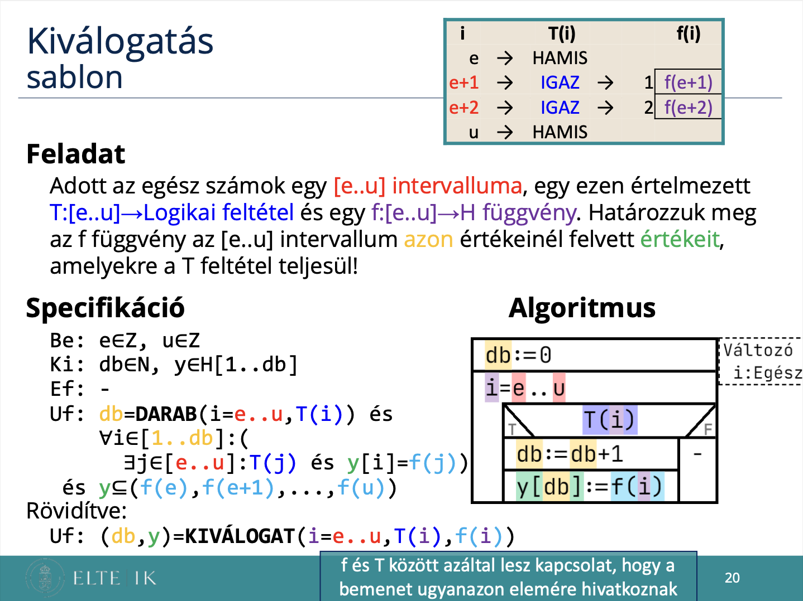
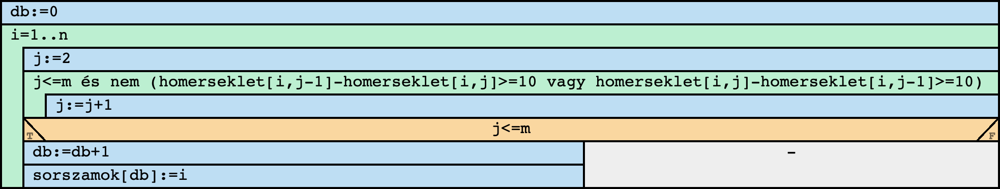
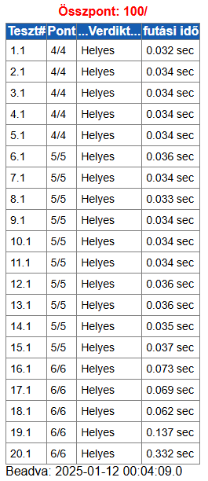

# Programozás komplex beadandó
## Nagy változású települések

### Feladat


### [Specifikáció](https://progalap.elte.hu/specifikacio/?data=H4sIAAAAAAAAE42RXU7CQBDHrzLpE02mZLftkrihJpgYYzD4ojxY%2BlBo1QK7GFpNlJDoG1fxHNyEkzgtUEqVxHa785H%2FzP5muzDSl3iUPCajMEtm2pDGRSxBb1arHoLamueZiudpPJnGGSUefN5saqRNBQPdTSREw60unc3Tj1DNJnmYq6IhKS4fJfC2p2H9nYJue5wxVviUVIWjKsnN6jOh8uKMQDYoHO9CRaElWNur4PgJjoOirp5se4KZ5kDf0%2BmNaIglmwkedK%2F766%2Bb26vOXSPximmg3%2Bk1xp5Nx2C9l8UDq97%2BnIjhLXx6%2F3VwXUrVudhESEwDjSxOs9SQ%2FsKIwiyk6wYtwRloUBIEmUq1BJ8S9PicIT9DbmPusAD3aeT7ZVeyJGvtlmXTD4D8i4YSbLLlPVB3G8EJiEmHKiYS8uZx%2BjrNDMmXeATobgFbpwAFcoG2QEegy2gvYSwitgQyFDl7hZJh%2BZY5mxU9cl2uFlV2p8ZOI6P7P3ixhXdOwjN0RRW6ICWUwxTEZNFgZI8HOKAXN3BE7P5B7JDkBHOw%2FAGmP1T9iwMAAA%3D%3D)
```groovy
Be: n∈N, m∈N, homerseklet∈Z[1..n,1..m]
Ki: db∈N, sorszamok∈N[1..db]
Ef: 1<=n és n<=1000 és 1<=m és m<=1000 és ∀i∈[1..n]:(∀j∈[1..m]:(-50<=homerseklet[i,j] és homerseklet[i,j]<=50))
Uf: (db,sorszamok) = KIVÁLOGAT(i=1..n, VAN(j=2..m, homerseklet[i,j-1]-homerseklet[i,j]>=10 vagy homerseklet[i,j]-homerseklet[i,j-1]>=10), i)
```

### Sablon



### Visszavezetés
```groovy
KIVÁLOGAT:
db   ~ db
y    ~ sorszamok
e..u ~ 1..n
T(i) ~ VAN(j=2..m, homerseklet[i,j-1]-homerseklet[i,j]>=10 vagy homerseklet[i,j]-homerseklet[i,j-1]>=10)
f(i) ~ i

VAN:
e..u ~ 2..m
T(i) ~ homerseklet[i,j-1]-homerseklet[i,j]>=10 vagy homerseklet[i,j]-homerseklet[i,j-1]>=10
```

### [Algoritmus](https://progalap.elte.hu/stuki/?data=H4sIAAAAAAAAE61W3W7aMBh9FeRK1abRKgm0ECYuSru2dKOtmv5AEReO7ZBAsFkSoKXigfYce7HZaWycFrRGm29ijj%2Bfc74fAi8gwKABjH3Drh4aZr1yYB1aNdM2D0AZ%2BGxOojY%2Fp7MwLIOYhAQlBK8RyjCJQeMF3NSvTjr2kyP2KaECymAKI0KT9SU%2FwJhQ0PBgGJMySJ6nhF%2BIyc8ZoYjwC8gPQszvtDHn7oMT5%2BT09qF7y0%2BC42%2FXqGt%2FB4NVeY1LTS1wrak72aKcwIRMeDiPSMhTwiHsNpoG4BrO9b29OGqdKQ0F5DSUr%2BLZjY6ureO2c8NPLozb3mNYqfLt3cJP6JIrikQVuzShyRVJdMGVUweM4iAJGBVUTXN%2Fn3LQZfjZyVy2c5lyB8qkdKC51hxoxflwqUeNpiUkKmdzP74PWkpCATkJrUZFK31%2BdRYOu%2B5jWlPFI%2BU04iIZbarpaDdMvjYnpd%2B%2F4hIlk9Inn01IFJNxSJJ%2BUB7tmYO9N9Bgd8ivmEZpDofPpbeHb6M5QRb%2FeVPnVOV4nippmacCcnlqxS7SudEXU4hM79oOnZoPSkQBOZHLcb3TmqHjrSKUsangU4GST7up8akvSfFZ%2BDG6dOqVq3S4rJ5vOd1lOhZRddk6DTtPSlkBOeUevnjs9sbwr5moQMmn3fw%2FmSiDwr7ikXIacZGpDrzNIy2aH81IK4IU%2BbmZ0zqUUm0IUalzo6r%2B0qjekAITs%2BXdjd1sMGVv1WBK4J9lYhbFSzhh4z52B41mAFZcL%2BbVQQkbRnAimvMCKJyI%2Bx0YiHfsHEYBdEPxkwn4x4ixd2%2Fu2GeL%2B3VYZkOg5wRiEmXQaiD6E3IPIrVXS32w43kGX5xmRzw90UWOIYW5xoHaeemuZlQMmO4QgV69BgavGbYgGg8jNqM4I3Yt1xJh4imJCZIYqSEod166w1VkEEvQiT8J7%2BgQX6kqX5LOsyRGPIy20Wk1fscqVpbzh%2Fg9z7ZfTw2jjmzxn2eHEFLFh3pFVqs%2FGfHrHiYJAAA%3D)


### Kód (C#)
```cs
using System;
using System.Collections.Generic;
namespace nagy_valtozasu_telepulesek
{
    class Program
    {
        static void Main(string[] args)
        {
            string[] sortomb = Console.ReadLine().Split(' ');
            int n = int.Parse(sortomb[0]);
            int m = int.Parse(sortomb[1]);
            int[,] homerseklet = new int[n,m];

            for (int i = 0; i < n; i++)
            {
                sortomb = Console.ReadLine().Split(' ');
                for (int j = 0; j < m; j++)
                {
                    homerseklet[i, j] = int.Parse(sortomb[j]);
                }
            }
            int db=0;
            List<int> sorszamok = new List<int>();
            for (int i = 0; i < n; i++)
            {
                int j = 1;
                while (j<m && !(homerseklet[i, j - 1] - homerseklet[i,j]>=10 || homerseklet[i, j] - homerseklet[i,j-1]>=10))
                {
                    j += 1;
                }
                if (j<m)
                {
                    db += 1;
                    sorszamok.Add(i+1);
                }
            }
            Console.Write($"{db} ");
            Console.Write(String.Join(' ', sorszamok));
        }
    }
}
```

### Bíró pontszám


### Saját tesztesetek
1.
```
4 6
5 15 25 35 40 35
-10 -5 0 5 10 20
0 0 0 0 0 0
20 25 30 20 10 5
```
2.
```
5 3
50 45 35
10 20 25
-30 -40 -30
0 0 0
25 15 5
```
