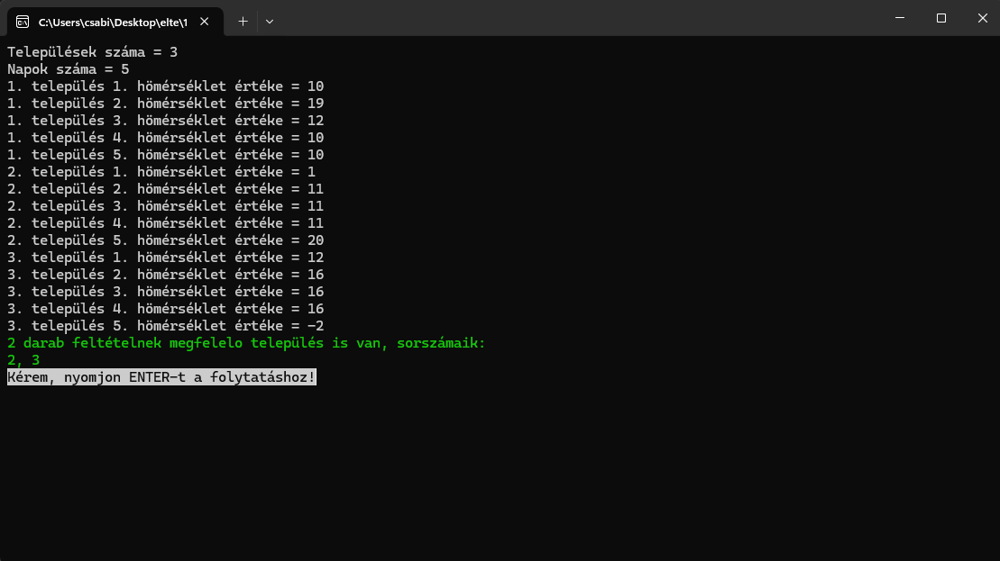
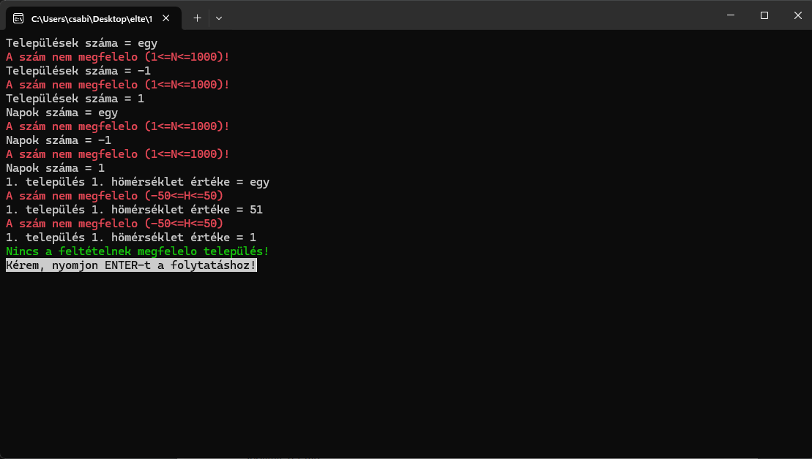
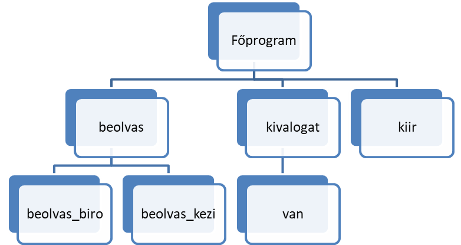
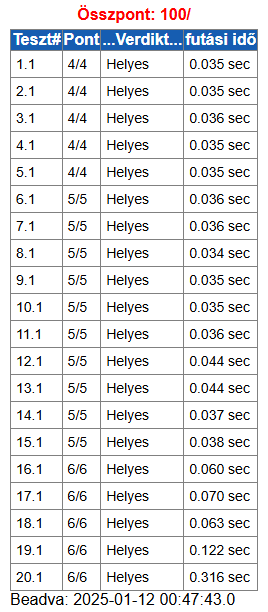

# Komplex beadandó feladat

## Tartalomjegyzék
- [Komplex beadandó feladat](#komplex-beadandó-feladat)
  - [Tartalomjegyzék](#tartalomjegyzék)
  - [Felhasználói dokumentáció](#felhasználói-dokumentáció)
    - [Feladat](#feladat)
    - [Futási környezet](#futási-környezet)
    - [Használat](#használat)
      - [*A program indítása*](#a-program-indítása)
      - [*A program használata billentyűzetről való bevitel esetén*](#a-program-használata-billentyűzetről-való-bevitel-esetén)
      - [*A program használata fájlból való bevitel esetén*](#a-program-használata-fájlból-való-bevitel-esetén)
      - [*A program kimenete*](#a-program-kimenete)
      - [*Minta bemenet és kimenet*](#minta-bemenet-és-kimenet)
      - [*Hibalehetőségek*](#hibalehetőségek)
        - [*Mintafutás hibás bemeneti adatok esetén:*](#mintafutás-hibás-bemeneti-adatok-esetén)
  - [Fejlesztői dokumentáció](#fejlesztői-dokumentáció)
    - [Feladat](#feladat-1)
    - [Tervezés](#tervezés)
      - [*Specifikáció*](#specifikáció)
      - [Visszavezetés](#visszavezetés)
      - [*Algoritmus*](#algoritmus)
    - [Fejlesztői környezet](#fejlesztői-környezet)
    - [Forráskód](#forráskód)
    - [Megoldás](#megoldás)
      - [*Függvénystruktúra*](#függvénystruktúra)
      - [*A kód*](#a-kód)
      - [*A kód (magas szintű függvényekkel)*](#a-kód-magas-szintű-függvényekkel)
    - [Tesztelés](#tesztelés)
      - [*Automatikus tesztek (Bíró)*](#automatikus-tesztek-bíró)
      - [*Automatikus tesztek (Bíró, magas szintű függvényekkel)*](#automatikus-tesztek-bíró-magas-szintű-függvényekkel)
      - [*Érvényes tesztesetek*](#érvényes-tesztesetek)
        - [1. teszteset: `teszt1.txt`](#1-teszteset-teszt1txt)
        - [2. teszteset: `teszt2.txt`](#2-teszteset-teszt2txt)
        - [3. teszteset: `teszt3.txt`](#3-teszteset-teszt3txt)
        - [4. teszteset: `teszt4.txt`](#4-teszteset-teszt4txt)
        - [5. teszteset: `teszt5.txt`](#5-teszteset-teszt5txt)
      - [*Érvénytelen tesztesetek*](#érvénytelen-tesztesetek)
        - [6. teszteset](#6-teszteset)
        - [7. teszteset](#7-teszteset)
        - [8. teszteset](#8-teszteset)
    - [Fejlesztési lehetőségek](#fejlesztési-lehetőségek)


## Felhasználói dokumentáció

### Feladat

**Nagy változású települések**  
A meteorológiai intézet az ország N településére adott M napos időjárás előrejelzést, az adott településen az adott napra várt legmagasabb hőmérsékletet.  
Készíts programot, amely megadja azokat a településeket, ahol a hőmérséklet egyik napról a következőre legalább 10 fokot változik!

### Futási környezet

IBM PC, exe futtatására alkalmas, 64-bites operációs rendszer (pl. Windows 11). Nem igényel egeret.

### Használat

#### *A program indítása*

A program az nagy_valtozasu_telepulesek\bin\Debug\net8.0\nagy_valtozasu_telepulesek.exe néven található a tömörített állományban.

#### *A program használata billentyűzetről való bevitel esetén*

Az nagy_valtozasu_telepulesek.exe fájl elindításával a program az adatokat a billentyűzetről olvassa be a következő sorrendben:

| #      | Adat                                          | Magyarázat                      |
| ------ | --------------------------------------------- | ------------------------------- |
| **1.** | Települések száma (N)                         | 1≤N≤1000                        |
| **2.** | Napok száma (M)                               | 1≤M≤1000                        |
| **3.** | 1. településen az 1. napon jósolt hőmérséklet | -50≤H<sub>i,j</sub>≤50 innentől |
| **4.** | 1. településen a 2. napon jósolt hőmérséklet  |                                 |
| ...    | ...                                           |                                 |
|        | 1. településen az m. napon jósolt hőmérséklet |                                 |
|        | 2. településen az 1. napon jósolt hőmérséklet |                                 |
|        | ...                                           |                                 |
|        | n. településen az m. napon jósolt hőmérséklet |                                 |

#### *A program használata fájlból való bevitel esetén*

Lehetőségünk van az adatokat **fájl**ban is megadni. Ekkor a programot *parancssorban* a következőképpen kell indítani, feltételezve, hogy a bemeneti fájlok mellette helyezkednek el:  
```nagy_valtozasu_telepulesek.exe < be1.txt```  
A fájl felépítésének a következő formai követelményei vannak. A standard bemenet első sorában a települések száma (N) és a napok száma (M) van. Az ezt követő N sorban az egyes napokra jósolt M hőmérséklet értéke található. Például:

```txt
3 5
10 19 12 10 10
1 11 11 11 20
12 16 16 16 -2
```

#### *A program kimenete*

A program kiírja azon települések T számát kell kiírni, ahol a hőmérséklet egyik napról a következőre legalább 10 fokot változik. Ezt követi ezen települések sorszáma.

#### *Minta bemenet és kimenet*



#### *Hibalehetőségek*

Az egyes bemeneti adatokat a fenti mintának megfelelően kell megadni. Hiba, ha bármelyik megadandó adat nem megfelelő szám. Hiba esetén a program azzal jelzi a hibát, hogy újra kérdezi azt.

##### *Mintafutás hibás bemeneti adatok esetén:*



## Fejlesztői dokumentáció

### Feladat

**Nagy változású települések**  
A meteorológiai intézet az ország N településére adott M napos időjárás előrejelzést, az adott településen az adott napra várt legmagasabb hőmérsékletet.  
Készíts programot, amely megadja azokat a településeket, ahol a hőmérséklet egyik napról a következőre legalább 10 fokot változik!

### Tervezés

#### [*Specifikáció*](https://progalap.elte.hu/specifikacio/?data=H4sIAAAAAAAAE42RXU7CQBDHrzLpE02mZLftkrihJpgYYzD4ojxY%2BlBo1QK7GFpNlJDoG1fxHNyEkzgtUEqVxHa785H%2FzP5muzDSl3iUPCajMEtm2pDGRSxBb1arHoLamueZiudpPJnGGSUefN5saqRNBQPdTSREw60unc3Tj1DNJnmYq6IhKS4fJfC2p2H9nYJue5wxVviUVIWjKsnN6jOh8uKMQDYoHO9CRaElWNur4PgJjoOirp5se4KZ5kDf0%2BmNaIglmwkedK%2F766%2Bb26vOXSPximmg3%2Bk1xp5Nx2C9l8UDq97%2BnIjhLXx6%2F3VwXUrVudhESEwDjSxOs9SQ%2FsKIwiyk6wYtwRloUBIEmUq1BJ8S9PicIT9DbmPusAD3aeT7ZVeyJGvtlmXTD4D8i4YSbLLlPVB3G8EJiEmHKiYS8uZx%2BjrNDMmXeATobgFbpwAFcoG2QEegy2gvYSwitgQyFDl7hZJh%2BZY5mxU9cl2uFlV2p8ZOI6P7P3ixhXdOwjN0RRW6ICWUwxTEZNFgZI8HOKAXN3BE7P5B7JDkBHOw%2FAGmP1T9iwMAAA%3D%3D)

```groovy
Be: n∈N, m∈N, homerseklet∈Z[1..n,1..m]
Ki: db∈N, sorszamok∈N[1..db]
Ef: 1<=n és n<=1000 és 1<=m és m<=1000 és ∀i∈[1..n]:(∀j∈[1..m]:(-50<=homerseklet[i,j] és homerseklet[i,j]<=50))
Uf: (db,sorszamok) = KIVÁLOGAT(i=1..n, VAN(j=2..m, homerseklet[i,j-1]-homerseklet[i,j]>=10 vagy homerseklet[i,j]-homerseklet[i,j-1]>=10), i)
```

#### Visszavezetés

```groovy
KIVÁLOGAT:
db   ~ db
y    ~ sorszamok
e..u ~ 1..n
T(i) ~ VAN(j=2..m, homerseklet[i,j-1]-homerseklet[i,j]>=10 vagy homerseklet[i,j]-homerseklet[i,j-1]>=10)
f(i) ~ i

VAN:
e..u ~ 2..m
T(i) ~ homerseklet[i,j-1]-homerseklet[i,j]>=10 vagy homerseklet[i,j]-homerseklet[i,j-1]>=10
```

#### [*Algoritmus*](https://progalap.elte.hu/stuki/?data=H4sIAAAAAAAAE61W3W7aMBh9FeRK1abRKgm0ECYuSru2dKOtmv5AEReO7ZBAsFkSoKXigfYce7HZaWycFrRGm29ijj%2Bfc74fAi8gwKABjH3Drh4aZr1yYB1aNdM2D0AZ%2BGxOojY%2Fp7MwLIOYhAQlBK8RyjCJQeMF3NSvTjr2kyP2KaECymAKI0KT9SU%2FwJhQ0PBgGJMySJ6nhF%2BIyc8ZoYjwC8gPQszvtDHn7oMT5%2BT09qF7y0%2BC42%2FXqGt%2FB4NVeY1LTS1wrak72aKcwIRMeDiPSMhTwiHsNpoG4BrO9b29OGqdKQ0F5DSUr%2BLZjY6ureO2c8NPLozb3mNYqfLt3cJP6JIrikQVuzShyRVJdMGVUweM4iAJGBVUTXN%2Fn3LQZfjZyVy2c5lyB8qkdKC51hxoxflwqUeNpiUkKmdzP74PWkpCATkJrUZFK31%2BdRYOu%2B5jWlPFI%2BU04iIZbarpaDdMvjYnpd%2B%2F4hIlk9Inn01IFJNxSJJ%2BUB7tmYO9N9Bgd8ivmEZpDofPpbeHb6M5QRb%2FeVPnVOV4nippmacCcnlqxS7SudEXU4hM79oOnZoPSkQBOZHLcb3TmqHjrSKUsangU4GST7up8akvSfFZ%2BDG6dOqVq3S4rJ5vOd1lOhZRddk6DTtPSlkBOeUevnjs9sbwr5moQMmn3fw%2FmSiDwr7ikXIacZGpDrzNIy2aH81IK4IU%2BbmZ0zqUUm0IUalzo6r%2B0qjekAITs%2BXdjd1sMGVv1WBK4J9lYhbFSzhh4z52B41mAFZcL%2BbVQQkbRnAimvMCKJyI%2Bx0YiHfsHEYBdEPxkwn4x4ixd2%2Fu2GeL%2B3VYZkOg5wRiEmXQaiD6E3IPIrVXS32w43kGX5xmRzw90UWOIYW5xoHaeemuZlQMmO4QgV69BgavGbYgGg8jNqM4I3Yt1xJh4imJCZIYqSEod166w1VkEEvQiT8J7%2BgQX6kqX5LOsyRGPIy20Wk1fscqVpbzh%2Fg9z7ZfTw2jjmzxn2eHEFLFh3pFVqs%2FGfHrHiYJAAA%3D)


### Fejlesztői környezet

IBM PC, exe futtatására alkalmas operációs rendszer (pl. Windows 11 Home). Visual Studio 2022 fejlesztői környezet.

### Forráskód

A teljes fejlesztői anyag –kicsomagolás után– a `nagy_valtozasu_telepulesek` nevű könyvtárban található meg. A fejlesztés során használt könyvtár-struktúra:

| Állomány                                                                     | Magyarázat                                        |
| ---------------------------------------------------------------------------- | ------------------------------------------------- |
| `nagy_valtozasu_telepulesek\bin\Debug\net8.0\nagy_valtozasu_telepulesek.exe` | futtatható kód (a futtatáshoz szükségesfájlokkal) |
| `nagy_valtozasu_telepulesek\obj\`                                            | mappa fordításhoz szükséges kódokkal              |
|                                                                              |                                                   |
| `nagy_valtozasu_telepulesek\Program.cs`                                      | C# forráskód                                      |
|                                                                              |                                                   |
| `nagy_valtozasu_telepulesek\teszt1.txt`                                      | teszt-bemeneti fájl<sub>1</sub>                   |
| `nagy_valtozasu_telepulesek\teszt2.txt`                                      | teszt-bemeneti fájl<sub>2</sub>                   |
| `nagy_valtozasu_telepulesek\teszt3.txt`                                      | teszt-bemeneti fájl<sub>3</sub>                   |
| `nagy_valtozasu_telepulesek\teszt4.txt`                                      | teszt-bemeneti fájl<sub>4</sub>                   |
| `nagy_valtozasu_telepulesek\teszt5.txt`                                      | teszt-bemeneti fájl<sub>5</sub>                   |
|                                                                              |                                                   |
| `nagy_valtozasu_telepulesek\doksi\nagy_valtozasu_telepulesek.docx`           | dokumentációk (ez a fájl)                         |

### Megoldás

#### *Függvénystruktúra*



#### *A kód*

A `Program.cs` fájl tartalma:

```cs
using System;
using System.Collections.Generic;
namespace nagy_valtozasu_telepulesek
{
    class Program
    {
        static int[,] beolvas()
        {
            if (Console.IsInputRedirected)
            {
                return beolvas_biro();
            }
            else
            {
                return beolvas_kezi();
            }
        }
        static int[,] beolvas_biro()
        {
            string[] sortomb = Console.ReadLine().Split(' ');
            int n = int.Parse(sortomb[0]);
            int m = int.Parse(sortomb[1]);
            int[,] homerseklet = new int[n, m];

            for (int i = 0; i < n; i++)
            {
                sortomb = Console.ReadLine().Split(' ');
                for (int j = 0; j < m; j++)
                {
                    homerseklet[i, j] = int.Parse(sortomb[j]);
                }
            }
            return homerseklet;
        }
        static int[,] beolvas_kezi()
        {
            int n, m;
            bool jo;
            do
            {
                Console.ResetColor();
                Console.Write("Települések száma = ");
                jo = int.TryParse(Console.ReadLine(), out n) && 1<=n && n<=1000;
                if (!jo)
                {
                    Console.ForegroundColor = ConsoleColor.Red;
                    Console.WriteLine("A szám nem megfelelő (1<=N<=1000)!");
                }
            } while (!jo);
            do
            {
                Console.ResetColor();
                Console.Write("Napok száma = ");
                jo = int.TryParse(Console.ReadLine(), out m) && 1 <= m && m <= 1000;
                if (!jo)
                {
                    Console.ForegroundColor = ConsoleColor.Red;
                    Console.WriteLine("A szám nem megfelelő (1<=N<=1000)!");
                }
            } while (!jo);

            int[,] homerseklet = new int[n,m];
            for (int i = 0; i < n; i++)
            {
                for (int j = 0; j < m; j++)
                {
                    do
                    {
                        Console.ResetColor();
                        Console.Write($"{i + 1}. település {j + 1}. hömérséklet értéke = ");
                        jo = int.TryParse(Console.ReadLine(), out homerseklet[i, j]) && -50 <= homerseklet[i, j] && homerseklet[i, j] <= 50;
                        if (!jo)
                        {
                            Console.ForegroundColor = ConsoleColor.Red;
                            Console.WriteLine("A szám nem megfelelő (-50<=H<=50)");
                        }
                    } while (!jo);
                }
            }
            return homerseklet;
        }

        static void kiir(int db, List<int> sorszamok)
        {
            if (Console.IsOutputRedirected)
            {
                Console.Write($"{db} ");
                Console.Write(String.Join(' ', sorszamok));
            }
            else
            {
                Console.ForegroundColor = ConsoleColor.Green;
                if (db == 0)
                {
                    Console.WriteLine("Nincs a feltételnek megfelelő település!");
                }
                else
                {
                    Console.WriteLine("{0} darab feltételnek megfelelő település is van, sorszámaik: ", db);
                    Console.WriteLine(String.Join(", ", sorszamok));
                }
                Console.ForegroundColor = ConsoleColor.Black;
                Console.BackgroundColor = ConsoleColor.Gray;
                Console.Write("Kérem, nyomjon ENTER-t a folytatáshoz!");
                Console.ResetColor();
                Console.ReadLine();
            }
        }
        static (int db, List<int> sorszamok) megold(int[,] homerseklet)
        {
            int db = 0;
            List<int> sorszamok = new List<int>();
            for (int i = 0; i < homerseklet.GetLength(0); i++)
            {
                int j = 1;
                while (j < homerseklet.GetLength(1) && Math.Abs(homerseklet[i, j - 1] - homerseklet[i,j])<10)
                {
                    j += 1;
                }
                if (j < homerseklet.GetLength(1))
                {
                    db += 1;
                    sorszamok.Add(i + 1);
                }
            }
            return (db, sorszamok);
        }
        static void Main(string[] args)
        {
            int[,] homerseklet;
            int db = 0;
            List<int> sorszamok = new List<int>();

            homerseklet = beolvas();

            (db, sorszamok) = megold(homerseklet);

            kiir(db, sorszamok);
        }
    }
}
```

#### *A kód (magas szintű függvényekkel)*

A `Program.cs` fájl tartalma:

```cs
using System;
using System.Collections.Generic;
using System.Linq;
using System.Numerics;
using System.Text;
using System.Threading.Tasks;
using magas_szintű_mintamegvalósítások;

namespace nagy_valtozasu_telepulesek_magas
{
    internal class Program
    {
        static void Main(string[] args)
        {
            int[,] homerseklet;
            int db;
            int[] sorszamok;

            homerseklet = beolvas();
            int n = homerseklet.GetLength(0);
            int m = homerseklet.GetLength(1);

            sorszamok = Mintak.Kivalogat(0, n - 1, i => Mintak.Van(1, m - 1, j => (Math.Abs(homerseklet[i, j - 1] - homerseklet[i, j]) >= 10)), i => i + 1);
            db = sorszamok.Length;

            kiir(db, sorszamok);
        }
        static void kiir(int db, int[] sorszamok)
        {
            if (Console.IsOutputRedirected)
            {
                Console.Write($"{db} ");
                Console.Write(String.Join(' ', sorszamok));
            }
            else
            {
                Console.ForegroundColor = ConsoleColor.Green;
                if (db == 0)
                {
                    Console.WriteLine("Nincs a feltételnek megfelelő település!");
                }
                else
                {
                    Console.WriteLine("{0} darab feltételnek megfelelő település is van, sorszámaik: ", db);
                    Console.WriteLine(String.Join(", ", sorszamok));
                }
                Console.ForegroundColor = ConsoleColor.Black;
                Console.BackgroundColor = ConsoleColor.Gray;
                Console.Write("Kérem, nyomjon ENTER-t a folytatáshoz!");
                Console.ResetColor();
                Console.ReadLine();
            }
        }

        static int[,] beolvas()
        {
            if (Console.IsInputRedirected)
            {
                return beolvas_biro();
            }
            else
            {
                return beolvas_kezi();
            }
        }
        static int[,] beolvas_biro()
        {
            string[] sortomb = Console.ReadLine().Split(' ');
            int n = int.Parse(sortomb[0]);
            int m = int.Parse(sortomb[1]);
            int[,] homerseklet = new int[n, m];

            for (int i = 0; i < n; i++)
            {
                sortomb = Console.ReadLine().Split(' ');
                for (int j = 0; j < m; j++)
                {
                    homerseklet[i, j] = int.Parse(sortomb[j]);
                }
            }
            return homerseklet;
        }
        static int[,] beolvas_kezi()
        {
            int n, m;
            bool jo;
            do
            {
                Console.ResetColor();
                Console.Write("Települések száma = ");
                jo = int.TryParse(Console.ReadLine(), out n) && 1 <= n && n <= 1000;
                if (!jo)
                {
                    Console.ForegroundColor = ConsoleColor.Red;
                    Console.WriteLine("A szám nem megfelelő (1<=N<=1000)!");
                }
            } while (!jo);
            do
            {
                Console.ResetColor();
                Console.Write("Napok száma = ");
                jo = int.TryParse(Console.ReadLine(), out m) && 1 <= m && m <= 1000;
                if (!jo)
                {
                    Console.ForegroundColor = ConsoleColor.Red;
                    Console.WriteLine("A szám nem megfelelő (1<=N<=1000)!");
                }
            } while (!jo);

            int[,] homerseklet = new int[n, m];
            for (int i = 0; i < n; i++)
            {
                for (int j = 0; j < m; j++)
                {
                    do
                    {
                        Console.ResetColor();
                        Console.Write($"{i + 1}. település {j + 1}. hömérséklet értéke = ");
                        jo = int.TryParse(Console.ReadLine(), out homerseklet[i, j]) && -50 <= homerseklet[i, j] && homerseklet[i, j] <= 50;
                        if (!jo)
                        {
                            Console.ForegroundColor = ConsoleColor.Red;
                            Console.WriteLine("A szám nem megfelelő (-50<=H<=50)");
                        }
                    } while (!jo);
                }
            }
            return homerseklet;
        }
    }
}

```

### Tesztelés

#### *Automatikus tesztek (Bíró)*


#### *Automatikus tesztek (Bíró, magas szintű függvényekkel)*



#### *Érvényes tesztesetek*

##### 1. teszteset: `teszt1.txt`

| **Bemenet** |
| ----------- |
| 3 4         |
| 10 20 30 40 |
| 5 15 25 35  |
| -10 0 10 20 |
| **Kimenet** |
| 3 1 2 3     |

##### 2. teszteset: `teszt2.txt`

| **Bemenet**         |
| ------------------- |
| 2 5                 |
| -10 -20 -30 -40 -50 |
| 50 40 30 20 10      |
| **Kimenet**         |
| 2 1 2               |

##### 3. teszteset: `teszt3.txt`

| **Bemenet**           |
| --------------------- |
| 4 6                   |
| 0 0 0 0 0 0           |
| 10 10 10 10 10 10     |
| -50 -40 -30 -20 -10 0 |
| 5 15 5 15 5 15        |
| **Kimenet**           |
| 2 3 4                 |

##### 4. teszteset: `teszt4.txt`

| **Bemenet** |
| ----------- |
| 1 3         |
| -5 10 -5    |
| **Kimenet** |
| 1 1         |

##### 5. teszteset: `teszt5.txt`

| **Bemenet**                 |
| --------------------------- |
| 5 7                         |
| 10 10 10 10 10 10 10        |
| -10 -10 -10 -10 -10 -10 -10 |
| 50 40 30 20 10 0 -10        |
| 15 15 25 15 25 15 25        |
| 0 10 20 30 40 50 50         |
| **Kimenet**                 |
| 3 3 4 5                     |

#### *Érvénytelen tesztesetek*

Billentyűzetes bevitel esetén

##### 6. teszteset

| **Bemenet** - *szöveges adat* |
| ----------------------------- |
| N = 11tizenegy                |
| **Kimenet**                   |
| Újrakezdés                    |
| N =                           |

##### 7. teszteset

| **Bemenet** - *nem megfelelő szám* |
| ---------------------------------- |
| N = -1                             |
| **Kimenet**                        |
| Újrakezdés                         |
| N =                                |

...

##### 8. teszteset

...

### Fejlesztési lehetőségek

1. Többszöri futtatás megszervezése
2. Települések nevének megadása
3. Grafikus visszajelzés a számolás lépéseiről
