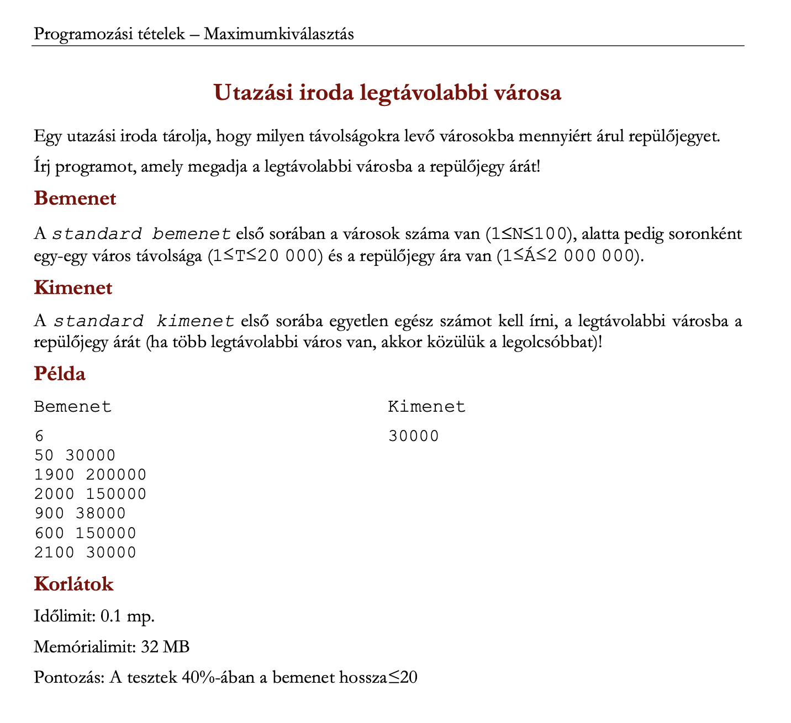
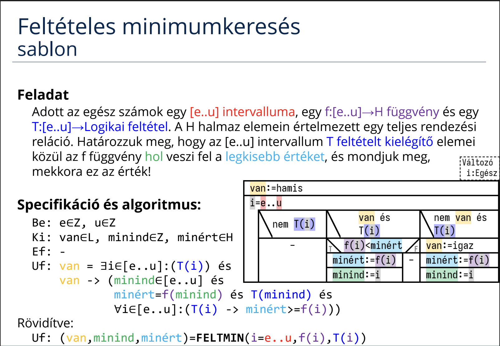
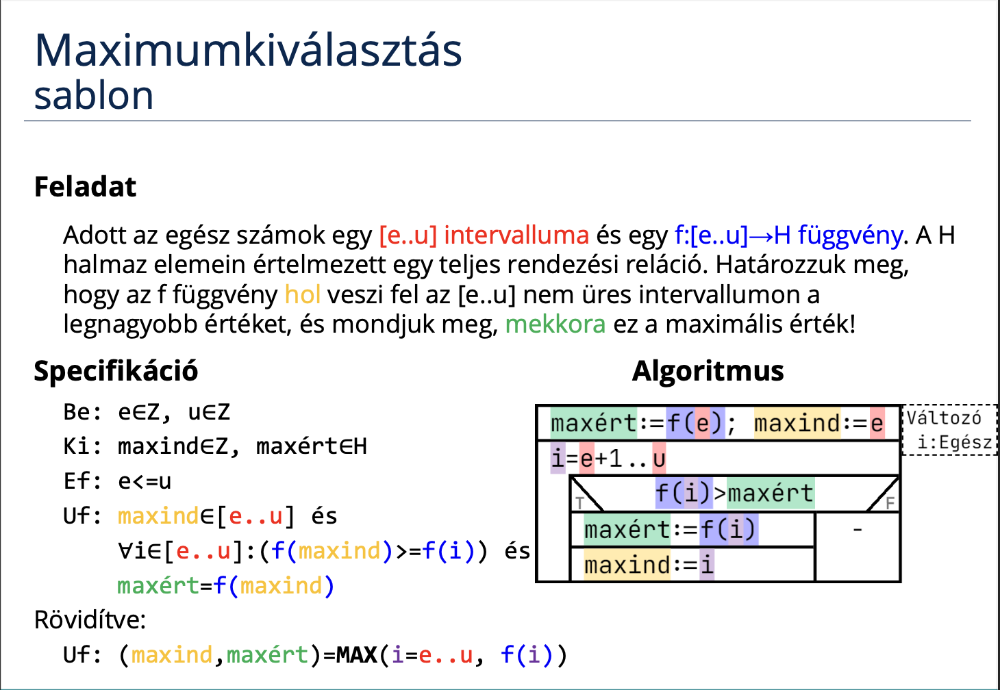
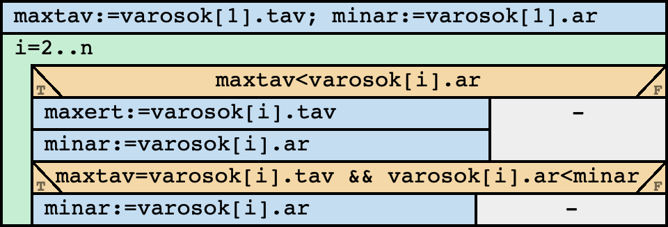

# Programozás 1. beadandó
## Utazási iroda legtávolabbi városa
## Feladat


## [Specifikáció](https://progalap.elte.hu/specifikacio/?data=H4sIAAAAAAAAE41RwUrDQBD9lWFPCSxlN7FFl%2B5BoYJoc7GCkOSw1BQW7VaSWAql4LG%2F4nf4J%2F0SZ7tLbNpUzGln3ps3703WpHovpnqmp6rWC0MEuSkEmN12m1CYLFW5qGRQq6VIYAWqFElIYd9dvCLHEVLe65k8M49KwFytkG3HM3OvsdZGla4czQTwoTRDyRmD768KMgP47bafGhlORQRI8QtSnfdQbCgjxvxEG1SlxxgLM%2FOE%2BgF1BkI5vn4OtLSajWGvF1oltzqgdG8wlLejh8n4LukaUeWxAkifMySU1EVVV0Ska%2FKiaoUHNAIGmfETAlK3am2PCH1G7RUhtp439BDiV8yDLlIbtT2H8v4p2ozGlyfY4K%2FBiLOWo8z%2BR5fNgVjZA3kc4xo1LzAkvsqi%2BnirieAbepj94lz2yKc7it3Z9VzeyeVHNhuP%2FD%2F%2B4nP%2BeOfObtexP1rbSfx7rTNO8s0P2HpCFnEDAAA%3D)
```
Be: n∈N, Tvaros=(tav:N x ar:N), varosok∈Tvaros[1..n]
Sa: maxtav∈N
Ki: minar∈N
Ef: 1<=n<=100 és 
    ∀i∈[1..n]:(1<=varosok[i].tav<=20000 és 1<=varosok[i].ar<=2000000)
Uf: (,maxtav)=MAX(i=1..n, varosok[i].tav) és
    (,,minar)=FELTMIN(i=1..n, varosok[i].ar, varosok[i].tav = maxtav)
```

## Sablon



## Visszavezetés
MAX:  
maxind, maxért ~ -, maxtav  
e..u           ~ 1..n  
f(i)           ~ varosok[i].tav  
FELTMIN:  
van, minind, minért ~ -,-,minar  
e..u                ~ 1..n  
f(i)                ~ varosok[i].ar  
T(i)                ~ varosok[i].tav = maxtav  

## [Algoritmus](https://progalap.elte.hu/stuki/?data=H4sIAAAAAAAAE61W227iMBD9lcor9QmhkDRQqPoA3YrSG7tAb1vx4NgOuISYOgF6Ef%2B%2BdsCD04tYtOQBnJOZc8bHYyfviFNUQ06xXHK9ku8dlip%2BuXzgVFEBDcWMyZZ6HE%2BjqIASFjGSMrpGYkFZgmrvKGiEv0e8fq3HGR8ABTTBksWpTkKXnlcV1SjW3JxSFqNaiKOEFVD6OmEqIBZighaFdaDhszLXfMsivmZK2POUxYSpBDLkEVU5LapqfUTh5a9SfDGrqyfi5k%2BSvHVuUF9pAm40rcBt5pCkOGVjFa4iUvaSKmiMX1I8qx3PsBSJGD2W%2BkV1f7Q35jGWORhLPf2rpyt%2FQAMJpQCQK2Xe80nl7i3aaCcEGj4r0%2BIDO7Y3dTj%2FOb9uBXfqSef%2BkkfN12FmKlAaZUtjG1PnSi6TFTHlKRcqAPFjt1jUKYGgr91VaXljVAXtsHTfuxgRqACAXAXN%2BcnUZ53uRi8h0PBZmRafZci2Xvrt54hPmnrvdM9Ou95DhWZe%2BrF7cR64bVAGIKc8fhKNDj7BG2cCgYbPytzRTEyBunzgMXIW8TZNzcMPfbDcXftRemQ2Es82ksqQU9aQOCbDXHtYK5ZRfxECVmjfzXqA7%2BsF2qaDvj4YmEzXJwDPDgYtCitvRAH4f9H8qcPNqUPCm5SI9BIkAchJDly%2FMwrrtxv7CwINn5Vp8cF5sX1%2FNetNp9vrDbL%2Buu88P7S9WQvkAMjJnctTGUnX21g%2BBBo%2BK3M35UOBunzgMXIW8Q62x4cW29vH48lR9rOXawS9jbIG%2BX77WMv43fYBq%2FSBaRYJDkwDbNdW%2F9zJSjNRpZNUDCQea6ffUYzHmuMKc%2F3CUAkcB5H%2BdkHqVgrx6TWUDMX8dh22KkWjZwxTJlfQoq%2FNjoTMPoOWZT2iH2HoqEvR%2FND%2FoV4ShRHAAseHUZiNKo7n4GxEGA4PK6i%2FnGUDk9FAimlMV8SBG7g6TP8bYkYMxioEm1GYjegBcZir6fTX2g7pLI8%2FseprNWd1ZbNSl8FC12AspGSJVavLp45zSKq%2BHjHGDmjZdmSx%2BAtjyzKergoAAA%3D%3D)


## Kód (C#)
```cs
using System;
namespace beadando_1
{
    class Program
    {
        struct Varos
        {
            public int tav;
            public int ar;
        };
        static void Main(string[] args)
        {
            int n = 0;
            int.TryParse(Console.ReadLine(), out n);
            Varos[] varosok = new Varos[n];
            string sor;
            int maxtav;
            int minar;

            for (int i = 0; i < n; i++)
            {
                sor = Console.ReadLine();
                int.TryParse(sor.Split(' ')[0], out varosok[i].tav);
                int.TryParse(sor.Split(' ')[1], out varosok[i].ar);
            }

            maxtav = varosok[0].tav;
            minar = varosok[0].ar;

            for (int i = 1; i < n; i++)
            {
                if (maxtav < varosok[i].tav)
                {
                    maxtav = varosok[i].tav;
                    minar = varosok[i].ar;
                }
                else if (maxtav == varosok[i].tav && minar > varosok[i].ar)
                {
                    minar = varosok[i].ar;
                }
            }

            Console.WriteLine(minar);
        }
    }
}
```

## Bíró pontszám és képernyőkép


## Saját tesztfájlok
### 1.
6  
50 30000  
1900 200000  
2000 150000  
900 38000  
600 150000  
2100 30000

### 2.
4  
2 2  
1 2  
2 1  
1 1  

### 3.
3  
1 1  
2 2  
3 3  
