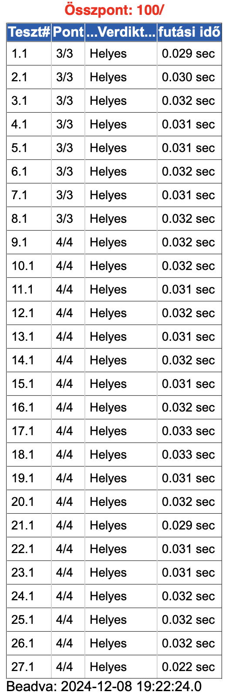
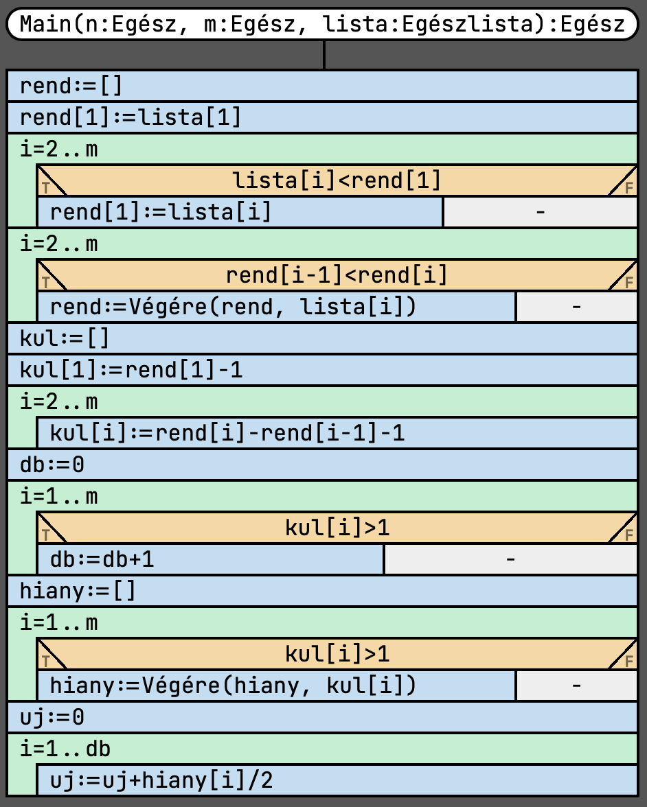
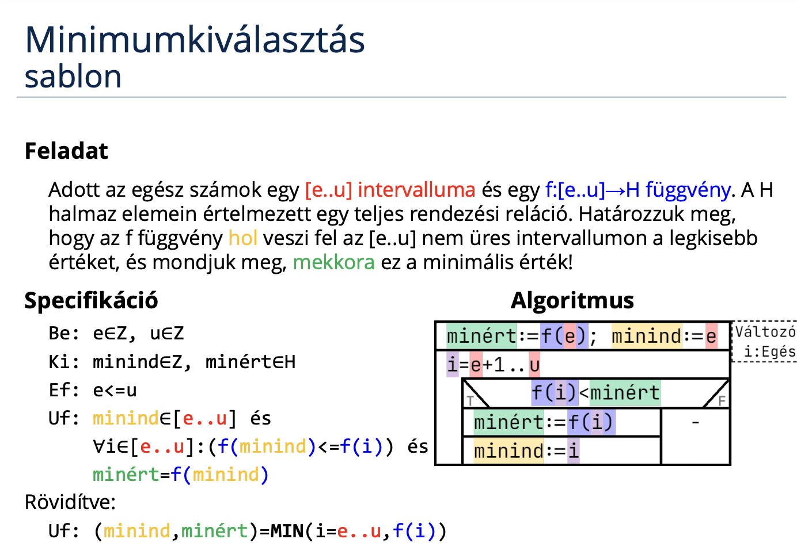

# Programozás 2. beadandó
## Új őrség küldése a Kínai Nagy Falra
### Feladat


### [Specifikáció](https://progalap.elte.hu/specifikacio/?data=H4sIAAAAAAAAE41SS07DMBS8yiMrKpkSu4WCRZCKQAjxkyiwIM0iIQHcNi4iyQIQEux6Fc7BTTgJz3bcOnwkqjR%2Bfpl5npnk2Svus2txI67jUkylx72djIP8nM1OCORmmYiijFUZ0nY7j4ZyEHOYPhTZbTa2bRkR0yqe4nw6XqAJjKuJu70TsXy0jTTBTpqo7VAeCg7VyNR7NxyW6VYg4eO9ALkVUN9v6Vp1c13l%2BLg1lBcI%2FZy9CiSaM5BZqwu19FBEEQRANX8oAX%2BOVHxyeHD58XZ0ut8%2FXxaBMkOsPaTCUgA%2BAdFqswUfPYVUDXUGqcYK0AXIimK1KEUS30lCkRqNFTPHUZsmSNrtn%2FV3jL5ch4rUbRelg%2F3FjYO2VcNLNULS4Ori%2BLhvCGlSvyVErrKWR7wyK8rC4%2BGzl8ZljB8JSA50Dfk5h01cdM4cwnUCHQKU4R8P6xJYI7CBG1xoF78cmytCMVO8qHP59u43O3RONBEhuWOHr5v5tD60q85ScPSJMGbHmUFsfoaCpAkHhqu2qsFMtauRaaNtGecZmsXqISuqSelx%2BkKaGfgmg66TAdPaegQ2fxj%2BadLR03TYnGLsUOtCJzLXbc3QWj39l%2FQNo7zjKDevrNeU%2FU3tn4IdslHra6msIbXe2%2Bh11n%2BojV6%2BAGf9qmOcBAAA)

```groovy
Be: n∈N, m∈N, lista∈N[1..m]
Sa: orsegek∈N[1..n], orsegszamok∈N[1..m], kul∈N[1..m], hiany∈N[1..db], db∈N
Ki: uj∈N
Ef: (1<=n és n<=100) és (1<=m és m<=n)
Uf: ∀i∈[1..m]: (orsegek[lista[i]] = 1) és
    orsegszamok = KIVÁLOGAT(i=1..n, orsegek[i] != 0, i).2 és
    kul[1] = orsegszamok[1] - 1 és
    ∀i∈[2..m]: (kul[i] = orsegszamok[i] - orsegszamok[i-1] - 1) és
    db = DARAB(i=1..m, kul[i]>1) és
    hiany = KIVÁLOGAT(i=1..m, kul[i]>1, kul[i]).2 és
    uj = SZUMMA(i=1..db, hiany[i]/2)
```

Itt nem lehet átírni a másolás sablonra a adott sorokat, mert csak az adott indexű elemek értékét szeretném változtatni.

### Sablon


### Visszavezetés
```groovy
MÁSOL: ∀i∈[e..u]:(y[i-e+1]=f(i))
e..u     ~ 1..m
y[i-e+1] ~ orsegek[lista[i]]
f(i)     ~ 1

KIVÁLOGAT:
y    ~ orsegszamok
e..u ~ 1..n
T(i) ~ orsegek[i] != 0
f(i) ~ i

MÁSOL: ∀i∈[e..u]:(y[i-e+1]=f(i))
e..u     ~ 2..m
y[i-e+1] ~ kul[i]
f(i)     ~ orsegszamok[i] - orsegszamok[i-1] - 1

DARAB:
db   ~ db
e..u ~ 1..m
T(i) ~ kul[i] > 1

KIVÁLOGAT:
y    ~ hiany
e..u ~ 1..m
T(i) ~ kul[i]>1
f(i) ~ kul[i]

SZUMMA:
s    ~ uj
e..u ~ 1..db
f(i) ~ hiany[i]/2
```

### [Algoritmus](https://progalap.elte.hu/stuki/?data=H4sIAAAAAAAAE61Y23LiOBD9laynamumhmSNuQW2eEhCCGRCLhAugeLBF%2FkCxia%2BJJhUPmi%2BY35sJIHa8g6uHe3GL7Qb6ZzT3ZLc9pvkGFJDkk8URa7VZaVeqZdq1aKslKWCZPsvKOji%2F73YdQtSiFykR8ggHuniUblou0MXD%2FN8A4VS402qloal66KcEJvCgqMgrdUAeVEKZjuGgTypYapuiApSlKwRnhCi5xh5OsITdNtxDTyna2DsmYRaTrEzfvXxP5p3Fm6M7SU2%2B5FXXY3cITY5QeNTs9KyL1fYvHwenVqdTQ%2BbL%2FY4aTlhF5sP3uliMim3sHnWfU0mo8o1QehcfWupbRmbynJ1o1zYxLwMdSc23YU0fy9Ig2fXrUTLACIEBx8hr1A0zqeVXa95ZUTpAIfRccAcHZfmw3SvmINy%2BZ7hRI6PB0hOs3hyQlKk%2BUYy2OvpZmLCCkAOUwCOjAIuDTkBR2qEVng4HhGhTYRdfhAiCy1nroP%2FnDnzeaNZJJRQU0bJFVkk6DzKcKuu%2FGWjOZsTNnlaaqHBIAQ2cGTYuNUlWtFk0UIamvZpRQGH0XHAIsHlVtQ7VFGICStIJpZ21%2FfTgMGRUQCqxQPuD5ffnqbDIQ14%2FNBrX7R6z0AHjgzdXXJ7fjsyH3PpPN9fE%2FkwkOFxMz9GPggk8gEHspUCc3TcojlM55j%2FKBZb%2Fc786I%2FmETlooiBG54Hq6Xamdlx5KOSBIZACsntY8mH3MEc2Pynqf9s9ox%2FfrR%2FfA%2FSZ8xaOnC9EA5y%2FUPP0QBZZ5Ac0LGMXp6zR5FhnxfkxPTjuW5H3ELWXQAuODC33SBBdGpZ%2F87TePN3SpQE4jI4DFony8FZWcg5niAkrADlMATgyCrg0%2FK88O%2FPjzO0xSzw8WZkO7lErkokDOgyt0ZQJx7S%2F1rdX9zZwgCPDwT3ZRYurTTaGb%2BmPtLiAw%2Bg4YJGQxJ68EBNWYC6C8yu9NwYF4Mi2Gky1eMDoZRotBs9lGnAl7Ny4N0raaoAje250uuPt%2FfA8l46d0zAQDs505sfIB4G0U2I40CmlwBwdt2h%2B85zebYQ%2FrejvopR7RnOlyTujIXwsFhLPxIIjI5ZDFdovhvaVbktobRkN1%2BuKrOEDNLajeglroczapF1Ck%2Ft0pTJHtoVK22vRUqO15fidpbVroRgOtFApsEhYYlsTYsIKXnt2udo%2FS89dcGQUgGrxgG%2Bn7bs4vH6iAa8vRn5y39kAHTiy%2BR1tx%2FHjIv7XrQkDIYHpzI%2BRDwKJfMCB1Z4C86s9XTQfuTW50uRtTQgfi4XEM7HgyIjlUEX3DDRO9L5wtIuC9k3w1snIuddQkZV9gDxe7J%2BjgzPnZdOy0v4QHNkmib31ihffrz5GQSXZN0kMB5qkFFgkpNzNamiHdisEhSWAHiYBHBkJXB6EshovvtJK4iL%2BpdDTnX2pgPWefroQCTn%2FlXl38GKqEC96PfKtQF2R1L9JnroiU3uq4332Gpd4oYXbwtEKLPquvb%2Bj9pf9DeZ4UQNH1VzyKUfCt4Hv%2FyI0tP3XDlINFEgNst92nlE6kUbwPid1crFYkoKd9Jn0yTRlfGGUT%2BTXJLsZ%2B3TwaXIFLJNaNbkkq9TSkWqe1qT5LhPnqr60Aj%2F2jD2wpmgKGUZ%2BGTDSmQ%2FVdJVZJrWMsi4jhcCRb1e%2FwOn4oqz4YnCmwnzINPQ8OK4gv6CSax%2Fzb%2BGbZr2%2B%2B1eWT%2FV6hVgIobJR5TPy%2Fv4Tmz0e18MTAAA%3D)


### Kód (C#)
```cs
using System;
namespace uj_orseg_kuldese_a_kinai_nagy_falra
{
    class Program
    {
        static void Main(string[] args)
        {
            string[] sortomb = Console.ReadLine().Split(' ');
            int n = int.Parse(sortomb[0]);
            int m = int.Parse(sortomb[1]);

            int[] lista = new int[m];
            for (int i = 0; i < m; i++)
                lista[i] = (int.Parse(Console.ReadLine()));

            int[] orsegek = new int[n];
            for (int i = 0; i < m; i++)
                orsegek[lista[i]-1] = 1;

            int[] orsegszamok = new int[m];
            int j = 0;
            for (int i = 0; i < n; ++i){
                if (orsegek[i] != 0){
                    orsegszamok[j] = i+1;
                    ++j;
                }
            }

            int[] kul = new int[m+1];
            kul[0] = orsegszamok[0] - 1;
            for (int i = 1; i < m; i++)
                kul[i] = orsegszamok[i] - orsegszamok[i - 1] - 1;
            
            if (orsegszamok[orsegszamok.Length - 1] != n)
            {
                kul[kul.Length - 1] = n - orsegszamok[orsegszamok.Length-1];
            }

            int db = 0;
            for (int i = 0; i < m+1; i++){
                if (kul[i]>1){
                    db = db + 1;
                }
            }

            int[] hiany = new int[db];
            j = 0;
            for (int i = 0; i < m+1; i++){
                if (kul[i]>1){
                    hiany[j] = kul[i];
                    ++j;
                }
            }

            int uj = 0;
            for (int i = 0; i < db; i++){
                uj = uj + hiany[i] / 2;
            }
            
            Console.WriteLine(uj);
        }
    }
}
/*
15 9
6
3
12
11
4
5
8
15
14
*/
```

### Bíró pontszám



### Saját tesztfájlok
1.
```
10 4
2
4
7
9
```
2.
```
8 3
1
4
7
```

## Másik megoldás
### [Specifikáció](https://progalap.elte.hu/specifikacio/?data=H4sIAAAAAAAAE42S207jMBCGX2WUKyKZErvlZDUrFYEQgrISpwvSXCQk1bo0BpHkAqFKrPamr7LPwZv0SRh74uJqhbRRI4%2FH%2F%2Fj%2FZpq3oH4uH9RUPWSNetKBDI5KCXq1XF4yqGiZq7rJTJjwXq9KJ%2Fo6k%2FBS6uIrx%2BCxnfvbXyrTry5R5JgpcrOd6HMloZ1RfDKVsMWHsYaPvzXoYcyjKLSxyVY2qvA4nOjbKXkmPIUYxmeXWyo2Xh1eotKwJ0zBRAM%2Bq%2BW7Qo9EGBw0WS3%2FGE%2FCw729Sm3zdEhRar26OKYrZ2kYft2IDZK3o9gG%2Fr2fUau1Whn12tJUehcXOcqOR1ejo3VLVP3DV9mBovD87O7j98XP09HNP2oXbQyinWHR9f3teDyigiLv%2Fh1U7giato51wIKmrJs6kMlbUGRNhp8CaAl8F%2B%2BpJBziYsciIdlj0GfABb5oOmCwy%2BAAN7jwAX4ftlXU9d3hHp3zrmhgtEaHvCjDVOR%2BKBEuiIykyCUIXC2yFQuTbmeURmydVSXCYvRS1u28CSRfsM0eIuph4PUgLNs%2Bg0MPeDNJdNxB8dTHcGy8g%2BH%2FRXJAIH0PhCa471F4GUKIrL%2FY8O%2F2bjx2Ht8gpItPvPyibOYDAAA%3D)
```groovy
Be: n∈N, m∈N, lista∈N[1..m]
Sa: rend∈N[1..m], kul∈N[1..m], hiany∈N[1..db], db∈N
Ki: uj∈N
Ef: (1<=n és n<=100) és (1<=m és m<=n)
Uf: rend[1] = MIN(i=1..m, lista[i]).2 és
    ∀i∈[2..m]: (∃j∈[1..m]: (rend[i-1]<rend[i] és rend[i]=lista[j])) és
    kul[1] = rend[1] - 1 és
    ∀i∈[2..m]: (kul[i] = rend[i] - rend[i-1] - 1) és
    db = DARAB(i=1..m, kul[i]>1) és
    hiany = KIVÁLOGAT(i=1..m, kul[i]>1, kul[i]).2 és
    uj = SZUMMA(i=1..db, hiany[i]/2) és n=n
```
***Ezt a stukiban nem lehet megírni, mivel nem tudunk olyan elemre hivatlkozni aminek még nem adtunk értéket.  
Ebbe a megoldásban annyi eltérés van, hogy egy segédlistával kevesebbet használ és egyel több fajta programozási mintát.***

### [Stuktogram](https://progalap.elte.hu/stuki/?data=H4sIAAAAAAAAE7VZ63LaOhB%2BlY4702mnNMfcL538gACBlCSQcAuZ%2FDC2jA3GJr5w6%2BSB%2Bhx9sSMJtJJPoKlaDn9YFun7vt3VSjJ8V2xDKSnqWbZQSObTGbWQzefSalpJKJa3RH4Tf%2BtGjpNQAuQgPUQG97iegQKl9F3JpXvpq6S6ITaFA0dCWWg%2BckM%2BybINA7lKydScACWUcLNAeEKAniPk6ghP0C3bMfCcpoGxH5XZg9lMJQ3yzXhi21ZKLWIzN812B43CGpu3d8lKZ458bHa3czcaoXtsDgpmtmrV5tisPfcLk8b6GptLa7Cp2kETmx23MB0OM1VslpurzbCfvcLmRePyW1Wrq9hMzeat1IVFzFqg25HpTJWnFwGZBStQ8WDFFBwJOdRCNMfD8YgQrUPsmkXOY%2FKpdI5BDGx8SSqYr10N3U5YnwEfOGJ8QpSyKZ54rYfF%2BuGGhgc4jE4AlglvhTkol%2Bcadmh7eIBin6fOzkiexp6xud%2FracZiwgpADlMAjpgCIQ1SCbZZgu2nL7v3LyzVsDwYs7BeZGI%2FwGyMS%2Bcq4RjdLfTtZdsCDnDEOITlKVvO8XBteBO9S8sJOIxOAJYJ6XA5k0fKCTFhBebUr1zq1wNQAI6YAlAtHzBajsLp%2FXOGBpwNGi2nlaoBHThidJtGc7Bt9ypH6VzPWxD5MJDhCTNPIx8EEvmAw%2BgEYIFOWDSH6WzzP8XaLf0Pk%2FBrkqxKP0IVX3N1K1Y3oTQU7sAQCB%2BLhcQzseCIiRVQpfrFGH%2BmbQn7M6MRNmyZNXyAxrI1d1M6f3yiKzU%2FrKfRsM1XKnPEeIQzQrbUaDGxvcZsQksNOIxOAJYJS641ISasYHVtZXJ3Zb7TgiOmAFTLB3wzqt9GwdUDDXhx0fc27cYa6MARz29%2FO4i60%2BjN1oSBkEA%2B8zTyQSCRDziw2jmwuNr5ojllawqlOdaaED4WC4lnYsEREyugyvZM%2F%2BePyc8fPvpIPyfe7aL4RMjh6sTIhbuUzMo%2BQB5N9%2BfofdlerquTHnCAI34tYlc3%2BeJ7uW7oZzf7axHDgWsRB5YJ6WizGuND3QpBYQmgh0kAR0yCkAeprEbTz7SSuIj%2FpAgf3KYZn3C9lgn58D2Mbbp21JzrrR6%2FHoDj758dcv3loPhwZ9EKwoMEIxKeLP4yHHKNZPHAQwoc4Pyp5QQ09PnAsfG32CJ8V8V8YLhJ3ujgiPPxBybZLKJa56KW2qZpFgEHHvU4sEx4co8HEBPZ2dKokOzc5PjOxhzxXZ%2Bplg%2F4drmerwYjmwbcHtU39VavzB%2B%2FmCNGp6ut2%2BtKoXyUjh1aMJDhCTNPIx8E0kOL4cChxYEFOmHR%2FOahtVuD%2BNhywq%2F7hakcPbyEEh07vCANWDQUgIkGR0y0gPqnPWTTHloEmetOZ8F3VnDEFzXbTuRrUvy2vLzvl3d3fMCBHuLAAp2wEZ6ihyAmsknVhlHrvnnBNynmiCkA1fIB6%2BlK5GeaLg04tbir6K7Lf8IAR%2FwyUtj2ts93wZs9BAPh3spnnkY%2BCCTyAYfRCcACnbBofrOHfPbzAzSR%2FYsmEmp0rIkgD2SjYRWAjYY5YqoFVKkmEi6A5GPiHWsoegP0021nqvVHQA6OGLk6QOPuRab%2BZsVhIMMTZgp4wm%2BBshXPrVTDdaxdhwIObEAc%2BP875SAmcvm6WS%2Fn4Q2vHjjiCexc2f1Kefl2AtlASCCfKUbEsiCfQKevTvTuc48msJrprKJKMgl04IjRbTJuYVa7mb8pHwYyPGHmaeSDQLpDMxzYoTmwzPL9y44XanSs4yEPWDVUgKkGh9ya%2BYOOx%2BwBDkIPvYmvzUlCvyuuNido15rtfnRLNTwz2CbezcGi0%2FefqP1p%2FwHTLjXf1sYO%2BXtBwR99z3vVcYHlrRpIM0iXkvztPH0%2BkQb1kgAhv4AVjloRdp%2BWg7hPpLCO59NDaJelR%2BW9aar4hWHek3eTlB%2F7dPCN1SxYJrXyalrVqKUjzSzkladd0iuaPpv4XuQae%2BBxapwiw8g7A0Y686G8rjHLpJaR0VWUInDkf5pXcDp%2BUVb8YnBmivmQaejH4IRCv0Ilr33Mv4VvmsXi7ltVLejFLLEQQhkjJ2bk5eVfvjzGvacaAAA%3D)
***A stukija valahogy így nézne ki, de ezen tisztán látszik, hogy nem működik rendesen.***


### +Sablon
